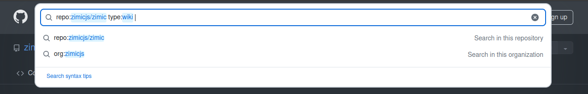

<p align="center">
  
</p>

<h1 align="center">
  Zimic
</h1>

<p align="center">
  TypeScript-first HTTP request mocking
</p>

<p align="center">
  <a href="https://www.npmjs.com/package/zimic">npm</a>
  <span>&nbsp;&nbsp;•&nbsp;&nbsp;</span>
  <a href="https://github.com/zimicjs/zimic/wiki">Docs</a>
  <span>&nbsp;&nbsp;•&nbsp;&nbsp;</span>
  <a href="#examples">Examples</a>
  <span>&nbsp;&nbsp;•&nbsp;&nbsp;</span>
  <a href="https://github.com/zimicjs/zimic/issues">Issues</a>
  <span>&nbsp;&nbsp;•&nbsp;&nbsp;</span>
  <a href="https://github.com/orgs/zimicjs/projects/1/views/5">Roadmap</a>
</p>

<div align="center">

[](https://github.com/zimicjs/zimic/actions/workflows/ci.yaml)&nbsp;
[](https://github.com/zimicjs/zimic/actions)&nbsp;
[](https://github.com/zimicjs/zimic/blob/canary/LICENSE.md)
[](https://www.npmjs.com/package/zimic)&nbsp;
[](https://github.com/zimicjs/zimic)&nbsp;

</div>

---

## Contents <!-- omit from toc -->

- [Features](#features)
- [What is Zimic for?](#what-is-zimic-for)
- [How does Zimic work?](#how-does-zimic-work)
- [Documentation](#documentation)
- [Examples](#examples)
- [Changelog](#changelog)

---

Zimic is a lightweight, thoroughly tested, TypeScript-first HTTP request mocking library, inspired by
[Zod](https://github.com/colinhacks/zod)'s type inference and using [MSW](https://github.com/mswjs/msw) under the hood.

## Features

Zimic provides a flexible and type-safe way to mock HTTP requests.

- :zap: **Statically-typed mocks**: Declare the
  [schema](https://github.com/zimicjs/zimic/wiki/API-reference:-Declaring-HTTP-service-schemas) of your HTTP endpoints
  and create fully typed mocks.
- :link: **Network-level intercepts**: Internally, Zimic combines [MSW](https://github.com/mswjs/msw) and
  [interceptor servers](https://github.com/zimicjs/zimic/wiki/CLI:-%60zimic-server%60#zimic-server) to act on real HTTP
  requests. From you application's point of view, the mocked responses are indistinguishable from the real ones.
- :wrench: **Flexibility**: Mock external services and reliably test how your application behaves. Simulate success,
  loading, and error states with ease.
- :bulb: **Simplicity**: Zimic was designed from the start to encourage clarity, simplicity, and robustness in your
  mocks, using official [web APIs](https://developer.mozilla.org/docs/Web/API). Check our
  [getting started guide](https://github.com/zimicjs/zimic/wiki/Getting-Started) and starting mocking!

```ts
import { type JSONValue } from 'zimic';
import { type HttpSchema } from 'zimic/http';
import { httpInterceptor } from 'zimic/interceptor/http';

type User = JSONValue<{
  username: string;
}>;

// Declare your service schema
type MyServiceSchema = HttpSchema.Paths<{
  '/users': {
    GET: {
      response: {
        200: { body: User[] };
      };
    };
  };
}>;

// Create and start your interceptor
const myInterceptor = httpInterceptor.create<MyServiceSchema>({
  type: 'local',
  baseURL: 'http://localhost:3000',
});

await myInterceptor.start();

// Declare your mocks
const listHandler = myInterceptor.get('/users').respond({
  status: 200,
  body: [{ username: 'diego-aquino' }],
});

// Enjoy!
const response = await fetch('http://localhost:3000/users');
const users = await response.json();
console.log(users); // [{ username: 'diego-aquino' }]
```

> [!NOTE]
>
> Zimic has gone a long way in v0, but we're not yet v1!
>
> Reviews and improvements to the public API are possible, so breaking changes may **_exceptionally_** land without a
> major release during v0. Despite of that, we do not expect big mental model shifts. Usually, migrating to a new Zimic
> release requires minimal to no refactoring. During v0, we will follow these guidelines:
>
> - Breaking changes, if any, will be delivered in the next **_minor_** version.
> - Breaking changes, if any, will be documented in the [version release](https://github.com/zimicjs/zimic/releases),
>   along with a migration guide detailing the introduced changes and suggesting steps to migrate.
>
> From v0.8 onwards, we expect Zimic's public API to become more stable. If you'd like to share any feedback, please
> feel free to [open an issue](https://github.com/zimicjs/zimic/issues/new) or
> [create a discussion](https://github.com/zimicjs/zimic/discussions/new/choose)!

## What is Zimic for?

Zimic is a development and testing tool that helps you mock HTTP responses in a type-safe way. Some of our best use
cases:

- **Testing**: If your application relies on external services over HTTP, you can mock them with Zimic to make your
  tests simpler, faster and more predictable. Each interceptor references a
  [schema declaration](https://github.com/zimicjs/zimic/wiki/API-reference:-`zimic`-http-schemas) to provide type
  inference and validation for your mocks. After breaking changes, adapting the interceptor schema will help you to
  quickly identify all of the affected mocks and keep your test scenarios consistent with the real-life API.
- **Development**: If you are developing a feature that depends on an external service that is unreliable, unavailable,
  or costly, you can use Zimic to mock it and continue your development without interruptions. Zimic can also be used to
  create mock servers, using
  [remote interceptors](https://github.com/zimicjs/zimic/wiki/Getting-Started#remote-http-interceptors) and
  [interceptor servers](https://github.com/zimicjs/zimic/wiki/CLI:-`zimic-server`#zimic-server), which can be accessible
  by multiple applications in your development workflow and even be containerized.

## How does Zimic work?

Zimic allows you to intercept HTTP requests and return mock responses. In
[local HTTP interceptors](https://github.com/zimicjs/zimic/wiki/Getting-Started#local-http-interceptors), Zimic uses
[MSW](https://github.com/mswjs/msw) to intercept requests in the same process as your application. In
[remote HTTP interceptors](https://github.com/zimicjs/zimic/wiki/Getting-Started#remote-http-interceptors), Zimic uses a
dedicated local [interceptor server](https://github.com/zimicjs/zimic/wiki/CLI:-`zimic-server`#zimic-server) to handle
requests. This opens up more possibilities for mocking, such as handling requests from multiple applications. Both of
those strategies act on real HTTP requests _after_ they leave your application, so no parts of your application code are
skipped and you can get more confidence in your tests.

## Documentation

- [Getting started](https://github.com/zimicjs/zimic/wiki/Getting-Started)
- [API reference](https://github.com/zimicjs/zimic/wiki/API-reference:-`zimic`)
- [CLI reference](https://github.com/zimicjs/zimic/wiki/CLI:-`zimic`)

> [!TIP]
>
> **How do I search the wiki?**
>
> To search resources in this wiki, click on the GitHub search bar (or press `/`), prefix your query
> `repo:zimicjs/zimic type:wiki` and type your search terms.
>
> 

## Examples

Visit our [examples](../../examples/README.md) to see how to use Zimic with popular frameworks, libraries, and use
cases!

## Changelog

The changelog is available on our [GitHub Releases](https://github.com/zimicjs/zimic/releases) page.
