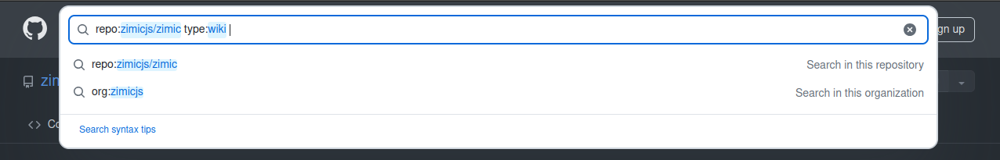

<p align="center">
  
</p>

<h1 align="center">
  Zimic
</h1>

<p align="center">
  TypeScript-first HTTP request mocking
</p>

<p align="center">
  <a href="https://www.npmjs.com/package/zimic">npm</a>
  <span>&nbsp;&nbsp;•&nbsp;&nbsp;</span>
  <a href="https://github.com/zimicjs/zimic/wiki">Docs</a>
  <span>&nbsp;&nbsp;•&nbsp;&nbsp;</span>
  <a href="#examples">Examples</a>
  <span>&nbsp;&nbsp;•&nbsp;&nbsp;</span>
  <a href="https://github.com/zimicjs/zimic/issues">Issues</a>
  <span>&nbsp;&nbsp;•&nbsp;&nbsp;</span>
  <a href="https://github.com/orgs/zimicjs/projects/1/views/5">Roadmap</a>
</p>

<div align="center">

[](https://github.com/zimicjs/zimic/actions/workflows/ci.yaml)&nbsp;
[](https://github.com/zimicjs/zimic/actions)&nbsp;
[](https://github.com/zimicjs/zimic/blob/canary/LICENSE.md)
[](https://www.npmjs.com/package/zimic)&nbsp;
[](https://github.com/zimicjs/zimic)&nbsp;

</div>

---

## Contents <!-- omit from toc -->

- [Features](#features)
- [What is Zimic for?](#what-is-zimic-for)
- [How does Zimic work?](#how-does-zimic-work)
- [Documentation](#documentation)
- [Examples](#examples)
- [Changelog](#changelog)

---

Zimic is a lightweight, thoroughly tested, TypeScript-first HTTP request mocking library, inspired by
[Zod](https://github.com/colinhacks/zod)'s type inference and using [MSW](https://github.com/mswjs/msw) under the hood.

## Features

Zimic provides a flexible and type-safe way to mock HTTP requests.

- :zap: **Statically-typed mocks**: Declare the
  [schema](https://github.com/zimicjs/zimic/wiki/api‐zimic‐interceptor‐http‐schemas) of your HTTP endpoints and create
  fully typed mocks. If you have an [OpenAPI v3](https://swagger.io/specification) schema, use
  [`zimic typegen`](https://github.com/zimicjs/zimic/wiki/cli‐zimic‐typegen) to automatically generate types and keep
  your mocks in sync with your API.
- :link: **Network-level intercepts**: Internally, Zimic combines [MSW](https://github.com/mswjs/msw) and
  [interceptor servers](https://github.com/zimicjs/zimic/wiki/cli‐zimic‐server) to act on real HTTP requests. From you
  application's point of view, the mocked responses are indistinguishable from the real ones.
- :wrench: **Flexibility**: Mock external services and reliably test how your application behaves. Simulate success,
  loading, and error states with ease using [standard web APIs](https://developer.mozilla.org/docs/Web/API).
- :bulb: **Simplicity**: Zimic was designed to encourage clarity, simplicity, and robustness in your mocks. Check our
  [getting started guide](https://github.com/zimicjs/zimic/wiki/getting‐started) and starting mocking!

```ts
import { type HttpSchema } from 'zimic/http';
import { httpInterceptor } from 'zimic/interceptor/http';

// 1. Declare your types
interface User {
  username: string;
}

interface RequestError {
  message: string;
}

// 2. Declare your HTTP schema
// https://github.com/zimicjs/zimic/wiki/api‐zimic‐interceptor‐http‐schemas
type MySchema = HttpSchema<{
  '/users': {
    POST: {
      request: { body: User };
      response: {
        201: { body: User }; // User create
        400: { body: RequestError }; // Bad request
        409: { body: RequestError }; // Conflict
      };
    };
    GET: {
      request: {
        headers: { authorization?: string };
        searchParams: { username?: string; limit?: `${number}` };
      };
      response: {
        200: { body: User[] }; // Users listed
        400: { body: RequestError }; // Bad request
        401: { body: RequestError }; // Unauthorized
      };
    };
  };
}>;

// 3. Create your interceptor
// https://github.com/zimicjs/zimic/wiki/api‐zimic‐interceptor‐http#httpinterceptorcreateoptions
const myInterceptor = httpInterceptor.create<MySchema>({
  type: 'local',
  baseURL: 'http://localhost:3000',
  saveRequests: true, // Allow access to `handler.requests()`
});

// 4. Manage your interceptor lifecycle
// https://github.com/zimicjs/zimic/wiki/guides‐testing
beforeAll(async () => {
  // 4.1. Start intercepting requests
  // https://github.com/zimicjs/zimic/wiki/api‐zimic‐interceptor‐http#http-interceptorstart
  await myInterceptor.start();
});

afterEach(() => {
  // 4.2. Clear interceptors so that no tests affect each other
  // https://github.com/zimicjs/zimic/wiki/api‐zimic‐interceptor‐http#http-interceptorclear
  myInterceptor.clear();
});

afterAll(async () => {
  // 4.3. Stop intercepting requests
  // https://github.com/zimicjs/zimic/wiki/api‐zimic‐interceptor‐http#http-interceptorstop
  await myInterceptor.stop();
});

// Enjoy mocking!
test('should list users', async () => {
  const users: User[] = [{ username: 'diego-aquino' }];
  const token = 'my-token';

  // 7. Declare your mocks
  // https://github.com/zimicjs/zimic/wiki/api‐zimic‐interceptor‐http#http-interceptormethodpath
  const listHandler = myInterceptor
    .get('/users')
    // 7.1. Use restrictions to narrow down your mocks and make declarative assertions
    // https://github.com/zimicjs/zimic/wiki/api‐zimic‐interceptor‐http#http-handlerwithrestriction
    .with({
      headers: { authorization: `Bearer ${token}` },
    })
    .with({
      searchParams: { username: 'diego' },
      exact: true,
    })
    // 7.2. Respond with your mock data
    // https://github.com/zimicjs/zimic/wiki/api‐zimic‐interceptor‐http#http-handlerresponddeclaration
    .respond({ status: 200, body: users });

  // 8. Run your application and make requests (`fetchUsers` is a fictional function)
  const fetchedUsers = await fetchUsers({
    token,
    filters: { username: 'diego' },
  });
  expect(fetchedUsers).toEqual(users);

  // 9. Assert yours requests
  // https://github.com/zimicjs/zimic/wiki/api‐zimic‐interceptor‐http#http-handlerrequests
  const listRequests = listHandler.requests();
  expect(listRequests).toHaveLength(1);

  // The following assertions are automatically checked by the restrictions declared in step 7.1.
  // If the request does not match the restrictions, the mock response will not be returned.
  // If you are not using restrictions, you can assert the requests manually:
  expect(listRequests[0].headers.get('authorization')).toBe(`Bearer ${token}`);

  expect(listRequests[0].searchParams.size).toBe(1);
  expect(listRequests[0].searchParams.get('username')).toBe('diego');
});
```

> [!NOTE]
>
> Zimic has gone a long way in v0, but we're not yet v1!
>
> Reviews and improvements to the public API are possible, so breaking changes may **_exceptionally_** land without a
> major release during v0. Despite of that, we do not expect big mental model shifts. Usually, migrating to a new Zimic
> release requires minimal to no refactoring. During v0, we will follow these guidelines:
>
> - Breaking changes, if any, will be delivered in the next **_minor_** version.
> - Breaking changes, if any, will be documented in the [version release](https://github.com/zimicjs/zimic/releases),
>   along with a migration guide detailing the introduced changes and suggesting steps to migrate.
>
> From v0.8 onwards, we expect Zimic's public API to become more stable. If you'd like to share any feedback, please
> feel free to [open an issue](https://github.com/zimicjs/zimic/issues) or
> [create a discussion](https://github.com/zimicjs/zimic/discussions/new/choose)!

## What is Zimic for?

Zimic is a development and testing tool that helps you mock HTTP responses in a type-safe way. Some of our best use
cases:

- **Testing**: If your application relies on external services over HTTP, you can mock them with Zimic to make your
  tests simpler, faster and more predictable. Each interceptor references a
  [schema declaration](api‐zimic‐interceptor‐http‐schemas) to provide type inference and validation for your mocks.
  After breaking changes, adapting the interceptor schema will help you to quickly identify all of the affected mocks
  and keep your test scenarios consistent with the real-life API.
- **Development**: If you are developing a feature that depends on an external service that is unreliable, unavailable,
  or costly, you can use Zimic to mock it and continue your development without interruptions. Zimic can also be used to
  create mock servers, using [remote interceptors](getting‐started#remote-http-interceptors) and
  [interceptor servers](cli‐zimic‐server), which can be accessible by multiple applications in your development workflow
  and even be containerized.

## How does Zimic work?

Zimic allows you to intercept HTTP requests and return mock responses. In
[local HTTP interceptors](getting‐started#local-http-interceptors), Zimic uses [MSW](https://github.com/mswjs/msw) to
intercept requests in the same process as your application. In
[remote HTTP interceptors](getting‐started#remote-http-interceptors), Zimic uses a dedicated local
[interceptor server](cli‐zimic‐server) to handle requests. This opens up more possibilities for mocking, such as
handling requests from multiple applications. Both of those strategies act on real HTTP requests _after_ they leave your
application, so no parts of your application code are skipped and you can get more confidence in your tests.

## Documentation

- [Getting started](getting‐started)
- [API reference](api‐zimic)
- [CLI reference](cli‐zimic)

> [!TIP]
>
> You can search these docs by clicking on [🔍 Search](https://github.com/search?q=repo%3Azimicjs%2Fzimic&type=wikis) on
> the sidebar. Then, type your query in the search bar at the top of the page:
>
> 

## Examples

Visit our [examples](../../examples/README.md) to see how to use Zimic with popular frameworks, libraries, and use
cases!

## Changelog

The changelog is available on our [GitHub Releases](https://github.com/zimicjs/zimic/releases) page.
