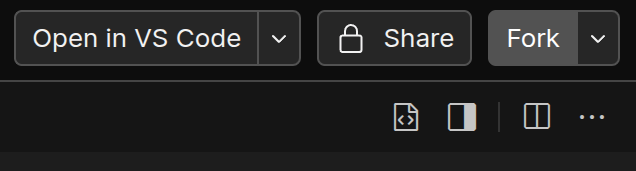

<h1>
  Zimic + Playwright
</h2>

This example uses Zimic with [Playwright](https://playwright.dev) in end-to-end tests.

## Application

The tested application is a simple [Next.js](https://nextjs.org) project, fetching repositories from the
[GitHub API](https://docs.github.com/en/rest).

- Application: [`src/app/page.tsx`](./src/app/page.tsx)
- GitHub fetch: [`src/services/github.ts`](./src/services/github.ts)

A `postinstall` script in [`package.json`](./package.json) is used to install Playwright's browsers.

> [!NOTE]
>
> **Preventing racing conditions**
>
> The mocks are loaded before starting the application to prevent racing conditions in tests. This example uses a single
> interceptor server, so we would need to reduce the number of workers to 1 if the mocks were applied inside the tests
> or `beforeEach`/`beforeAll`/`afterEach`/`afterAll` hooks. That would make the tests significantly slower in large
> applications, which is a trade-off to consider.
>
> If using a single test worker is not a problem for your project, applying the mocks inside your tests or hooks is
> perfectly possible. On the other hand, if you need parallelism, you can still simulate dynamic behavior by creating
> all of the mocks you need beforehand in a load script like in this example. Using
> [restrictions](https://github.com/zimicjs/zimic/wiki/api‐zimic‐interceptor‐http#http-handlerwithrestriction) is a good
> way to narrow down the scope of those mocks.

## Testing

An example test suite uses [Playwright](https://playwright.dev) to test the application. Zimic is used to mock the
GitHub API and simulate a test case where the repository is found and another where it is not.

### Zimic

- GitHub interceptor and mocks: [`tests/interceptors/github.ts`](./tests/interceptors/github.ts)

#### Loading mocks

The script [`tests/interceptors/scripts/load.ts`](./tests/interceptors/scripts/load.ts) loads the interceptors and mocks
before the application is started in development. It is used by the command `dev:mock` in
[`package.json`](./package.json).

### Test

- Test suite: [`src/app/__tests__/HomePage.e2e.test.ts`](./src/app/__tests__/HomePage.e2e.test.ts)
- Playwright configuration: [`playwright.config.ts`](./playwright.config.ts)

## Running

### Running in CodeSandbox

<a href="https://codesandbox.io/p/sandbox/github/zimicjs/zimic/tree/main/examples/with-playwright">
  
</a>

After opening in CodeSandbox, click "Fork" on the top right to create your own copy of the example. The terminal should
open automatically once your fork is ready.



### Running locally

1. Install the dependencies:

   ```bash
   pnpm install
   ```

2. Run the tests:

   1. Start the application:

      ```bash
      pnpm run dev:mock
      ```

      After started, the application will be available at [http://localhost:3006](http://localhost:3006).

   2. In another terminal, run the tests:

      ```bash
      pnpm run test --ui
      ```
