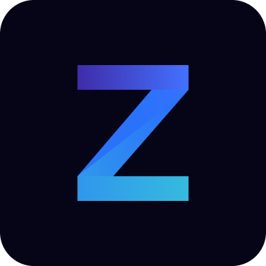

<p align="center">
  
</p>

<h1 align="center">
  @zimic/interceptor
</h1>

<p align="center">
  Next-gen TypeScript-first HTTP and WebSocket intercepting and mocking
</p>

<p align="center">
  <a href="https://www.npmjs.com/package/@zimic/interceptor">npm</a>
  <span>&nbsp;&nbsp;•&nbsp;&nbsp;</span>
  <a href="https://zimic.dev">Docs</a>
  <span>&nbsp;&nbsp;•&nbsp;&nbsp;</span>
  <a href="https://zimic.dev/docs/examples">Examples</a>
  <span>&nbsp;&nbsp;•&nbsp;&nbsp;</span>
  <a href="https://github.com/zimicjs/zimic/issues">Issues</a>
  <span>&nbsp;&nbsp;•&nbsp;&nbsp;</span>
  <a href="https://github.com/orgs/zimicjs/projects/1/views/4">Roadmap</a>
</p>

<div align="center">

[](https://github.com/zimicjs/zimic/actions/workflows/ci.yaml)&nbsp;
[](https://github.com/zimicjs/zimic/actions)&nbsp;
[](https://github.com/zimicjs/zimic/blob/canary/LICENSE.md)&nbsp;
[](https://github.com/zimicjs/zimic)

[](https://www.npmjs.com/package/@zimic/interceptor)&nbsp;
[](https://bundlephobia.com/package/@zimic/interceptor)&nbsp;

</div>

---

`@zimic/interceptor` is a type-safe interceptor library for handling and mocking HTTP requests and WebSocket messages in
development and testing.

`@zimic/http` and `@zimic/ws` are optional peer dependencies. Install only the schema package for the protocol you use:
`@zimic/http` for HTTP interceptors, `@zimic/ws` for WebSocket interceptors, or both if your project uses both.

## Installation

For HTTP interception, install the stable HTTP schema package and interceptor entry point:

```bash
pnpm add @zimic/http @zimic/interceptor --dev
```

For experimental WebSocket interception, install the WebSocket schema package instead:

```bash
pnpm add @zimic/ws @zimic/interceptor --dev
```

Install both schema packages only when the project intercepts both protocols.

## Runtime requirements

HTTP interception requires the [Fetch API](https://developer.mozilla.org/docs/Web/API/Fetch_API). Browsers must provide
Fetch natively or through a polyfill. Server-side interception requires Node.js 22 or later.

WebSocket interception requires a native or polyfilled
[WebSocket API](https://developer.mozilla.org/docs/Web/API/WebSocket) in the client runtime. Browsers normally provide
it natively; Node.js clients must expose the native `WebSocket` or a compatible polyfill. Every Node.js project
consuming the WebSocket interceptor packages requires Node.js 22.4 or later, including processes declaring local or
remote interceptors and interceptor servers. Local browser interception also requires an
[initialized mock service worker](https://zimic.dev/docs/interceptor/cli/browser#zimic-interceptor-browser-init).

## Highlights

- :globe_with_meridians: **HTTP interceptors**

  Use your [`@zimic/http` schema](https://zimic.dev/docs/http/guides/schemas) to declare
  [local](https://zimic.dev/docs/interceptor/guides/http/local-interceptors) and
  [remote](https://zimic.dev/docs/interceptor/guides/http/remote-interceptors) HTTP interceptors. Mock external services
  and simulate success, loading, and error states with ease and type safety.

- :zap: **WebSocket interceptors**

  Use your [`@zimic/ws` schema](https://zimic.dev/docs/ws/guides/schemas) to declare
  [experimental WebSocket interceptors](https://zimic.dev/docs/interceptor/guides/ws/local-interceptors). Mock typed
  message flows, observe connected clients, send server messages, and verify expected messages in development and tests.

- :link: **Network-level interception**

  `@zimic/interceptor` combines [MSW](https://github.com/mswjs/msw) and
  [interceptor servers](https://zimic.dev/docs/interceptor/cli/server) to handle real HTTP requests and WebSocket
  connections. From your application's point of view, the mocked responses and messages are indistinguishable from the
  real ones.

- :bulb: **Readability**

  `@zimic/interceptor` was designed to encourage clarity and readability. Declare intuitive mocks, test with confidence,
  and verify that your application is making the expected HTTP requests or WebSocket messages with
  [declarative assertions](https://zimic.dev/docs/interceptor/guides/http/declarative-assertions).

**Learn more**:

- [`@zimic/interceptor` - Getting started](https://zimic.dev/docs/interceptor/getting-started)
- [`@zimic/interceptor` - Guides](https://zimic.dev/docs/interceptor/guides)
- [`@zimic/interceptor` - API](https://zimic.dev/docs/interceptor/api)
- [`@zimic/interceptor` - CLI](https://zimic.dev/docs/interceptor/cli)
