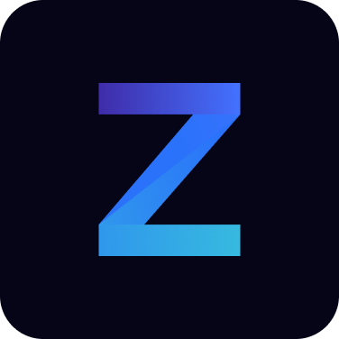

  

<h1 align="center">
  @zimic/ws
</h1>

  Next-gen TypeScript-first WebSocket client and server

  <a href="https://www.npmjs.com/package/@zimic/ws">npm</a>
  &nbsp;&nbsp;•&nbsp;&nbsp;
  <a href="https://zimic.dev">Docs</a>
  &nbsp;&nbsp;•&nbsp;&nbsp;
  <a href="https://zimic.dev/docs/examples">Examples</a>
  &nbsp;&nbsp;•&nbsp;&nbsp;
  <a href="https://github.com/zimicjs/zimic/issues">Issues</a>
  &nbsp;&nbsp;•&nbsp;&nbsp;
  <a href="https://github.com/orgs/zimicjs/projects/1/views/4">Roadmap</a>

&nbsp;
&nbsp;
&nbsp;

&nbsp;
 

---

`@zimic/ws` is a minimal and type-safe WebSocket client and server.

> [!NOTE]
>
> Status: 🚧 Alpha

## Highlights

🚧 TODO

**Learn more**:

🚧 TODO
